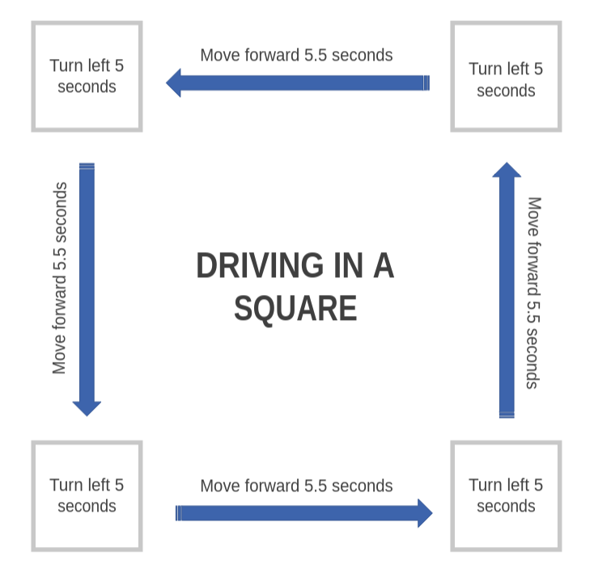
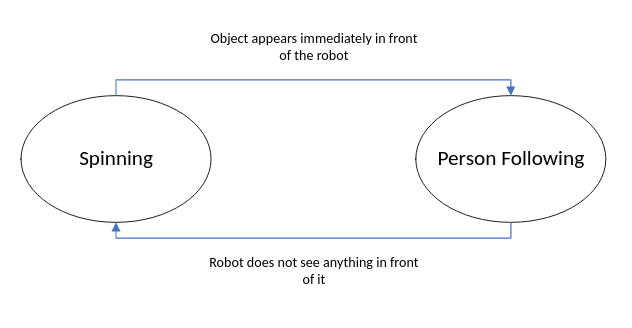

# warmup_project

Warm-Up Project for Comp Robo '22 by Daniel Park and Gabrielle Blake

## Abstract

The first project in this course, rightfully named the "Warmup Project", is meant to be an exercise to getting to know the ROS platform and working with the Neato robots. We developed a couple of behaviors for the robot: a basic TeleOp, driving in a square, wall following, person following, obstacle avoidance, and finally combining two of the behaviors: wall following and person tracking.

## Behaviors

For each behavior, we will describe the problem at a high-level, our strategy to approaching these solutions, and include any relevant diagrams that help explain our approach.

### Tele-Op

The tele-operation behavior is responsible for the robot being able to be controlled through keyboard commands. The approach used to achieve this behavior was to create a series of if statements such that depending on the key pressed, the robot would perform a different action.\newline 

In this case, the 'w' key would make the robot drive straight forward, the 'a' key would make it turn left in place, the 's' key would make it drive straight backwards, the 'd' key would make it turn right in place, the space bar was used to make the robot stop moving, and pressing 'control-c' would end the program. The robot drives straight and can turn through publishing messages to the `cmd_vel` ROS topic to control the robot's linear and angular velocity at any given time, depending on what key is pressed.

### Driving in a Square

As described by the project, this behavior drives in a meter-by-meter square as seen in the figure below. It does so by continuously going forward for a couple of seconds then turning ninety degrees to go in a square shape pattern.

For this behavior, we decided to use the timing to make the robot go in a square. While it would have been a better implementation on our end to control the robot's movement with odometry measurements since we had to hardcode the times we wanted to move forward and turn to accurately make a 1m by 1m square movement, we decided to use timing to save time for our next few sequences for wall and person following, which would take more time than this sequence. In addition, we wanted to use this motion to test out how to control motors in an automated setting (without a driver control). So using the previous Tele-Op commands, we just needed to control the motors going up and turning left after specific moments of time to finish this sequence.

### Wall Following

The wall-following behavior programs the robot drive parallel to walls when they are detected. We programmed the robot to drive along a wall at a distance of approximately 0.75 m from the wall.

In order to do this, we utilized the scan ROS topic to detect walls by looking for lines (which would be walls) in the robot's scans. We took the ranges of the scans at four angles, 5 and ten degrees above and below 90 degrees, so 80, 85, 95, and 100 degrees. To detect walls, we took the differences between the ranges at these angles and if they were sufficiently similar (all of the differences were under 0.5 m from each other), we assumed that there was a wall there. If a wall was detected, then the distance from the wall was evaluated using the most forward facing angle, which was 80 degrees. If the difference between the range being reported from 80 degrees and the ideal wall-distance of 0.75 m, was greater than 0.2 m the robot would turn to readjust depending on the sign of the difference. If the difference was positive, meaning the robot was driving too far or away from the wall, we would make it turn towards the wall by changing the angular velocity. If the difference was negative, meaning the robot was too close to the wall, we would make the angular velocity turn the robot away from the wall.

### Person Following

### Obstacle Avoidance

### Finite State Control

To combine in two behaviors, we decided to combine spinning and person following. As the diagram below suggests, if the Neato finds an object in front of it, the Neato will follow the object. However, if the Neato loses sight of the object, it will spin around slowly in search of new objects until it sees something in front of it.

The state transition diagram demonstrates one flow moving to another. When the robot is spinning around, it is actively looking for an object to follow. If it sees an object in front of it, the robot will follow it as in **Person Following**. If the robot loses sight of the object in front of it, it will return to its default behavior of spinning around.

## Code Structure

The code for our implementations above are grouped by classes with names of their behaviors. (**Person Following** -> *person_following.py*) Within each class, there is a `main` function that creates the class Node object which defines all our behavior. In extension, the `main` function gets called within the file to the `__name__` attribute for the robot to compile. For example **Wall Following** has a node called `WallFollowerNode` that defines all the behavior and called in the `main` function as a class object and processed through `rcipy`, the ROS Python compiler.

## Challenges, Improvements, and Finishing Remarks

If we had more time, we would like to go above and beyond early to at least attempt the instructions in the *Go Beyond* sections. However, due to our time conflicts and commitments with other activities, we weren't able to get ahead as early as we would have liked. A lot of the content in the *Go Beyond* sections are fascinating, and something we would love to learn when delving into computational robotics. In the future, we would like to get ahead as early as possible, hit any roadblocks which we can then solve with the CAs and Paul, and go in depth of the *Go Beyond* sections to learn more about what ROS can accomplish.

To help alleviate that, we should have taken advantage of the robot odometry readings and also wrote helper functions to restructure our code. For the odometry readings, a lot of the content echoed from the odometry ROS topic had a lot of readings on headings, angles, speeds, and distance that would have been extremely useful for some of our implementations. For example, instead of using time to do the **Drive Square** behavior and be a victim to the variable nature of the MAC carpet floor, we should have learned more about taking advantage of those readings, something we eventually did in **Person Following** and **Obstacle Avoidance**, to make a more stable drive. 

In addition, our code is relatively unstructured with a lot of the code implementation going into its own behavior function and calling that function in the `main` function to compile. While that did work in this project since the implementation was straightforward, going forward into further projects where behaviors will be more complex, we need to be more mindful of seperating our code into helper functions so it will be easier to debug as we make progress.

Going into the next project, we hope to take advantage of what we learned about Neatos in this Warmup Project and make cool robots do cool things!